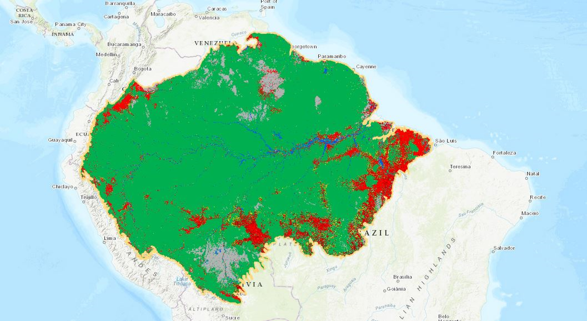

South American Deforestation 

# South_American_Deforestation-
Final Project for UC Davis Boot Camp 2021

GROUP PROJECT 5
Deforestation:
To classify whether forests in South America (?) is growing or shrinking. 
We will be analyzing data sets to find out what contributes to deforestation or growth.
Using ML, we can then predict whether the forest for each country (?) will be classified as growing or not.  We are planning on using a combination of clustering and Regression analysis. 
To visualize, we will use Tableau or Map (in D3?) to plot the graphs of the scale of the forests.

We will utilize the following data sets:

* We got our data sets for forest data per country in South America :
*Carmen [datarepository.movebank.org](https://www.datarepository.movebank.org/handle/10255/move.837)
*Kate[ourworldindata.org]( https://ourworldindata.org/forest-area#how-much-of-the-earth-s-surface-is-forested).

* We found and downloaded the data for deforestation factors:
*Jade cleaned and worked on: [kaggle.com]( https://www.kaggle.com/chiticariucristian/deforestation-and-forest-loss).
*Jose cleaned [earthenginepartners.appspot.com]( https://earthenginepartners.appspot.com/science-2013-global-forest/download_v1.7.html).

### Objective

After assembling the dataset, we will be using pandas and pycaret to create cluster and regrston analysis of the amzon rainforest per a country. We will create a prediction model to predict the rainforest size per a country in South America.

We will create a dashboard page with a dropdown menu that will allow for a user to select which Country they want to investigate. We will also use Tableau to make map visulizations. 

