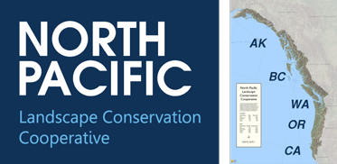

## Project 2: West Coast Animal Migratory Paths

### Overview

We have just landed our dream job at World Wide Animal Conservation as a data analyst. Our first assignment will be to study and analyze the migration paths for Blue Fin Whales and Blue Whales in the southern portion of the North Pacific Landscape Conservation Cooperative (NPLCC) region including CA, OR and WA. In addition we will be studying the migration paths of the Argentine Barn Swallows in South America. 

### Data

To accomplish this analysis, we first built three different sets of dataframes with the data pulled from the following websites: 

* We found and downloaded the data for our Blue Fin Whales from [dataone.org](https://search.dataone.org/view/10.24431%2Frw1k463).

* We got our data for the blue whales migration path from [datarepository.movebank.org](https://www.datarepository.movebank.org/handle/10255/move.837).

* We found and downloaded the data for our Argentine Barn Swallows from [datarepository.movebank.org](https://www.datarepository.movebank.org/handle/10255/move.657).

### Objective

After assembling the dataset, we will be using leaflet with the [MapBox Api](https://docs.mapbox.com/) in order to call in our maps and to plot multiple sets of data from each animal species based on their location in order to track their migration paths through out the year.

We will create a dashboard page with a dropdown menu that will allow for a user to select which animal path they would like to track. We will also use [Turf.js](https://docs.mapbox.com/mapbox-gl-js/example/animate-point-along-route/) to create an animation for each species. This will allow us to show a specifice animals actual actual migration path movements throughout the year based on a starting point and where it finishes at the end of the year  . 
